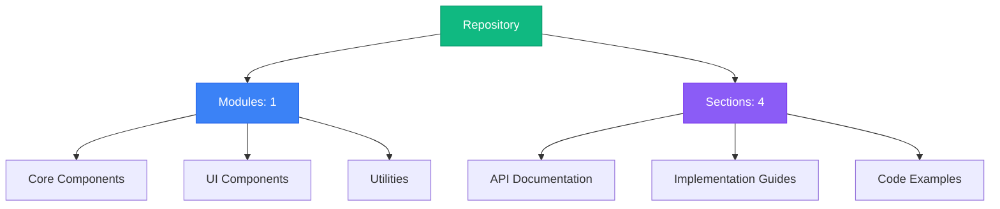
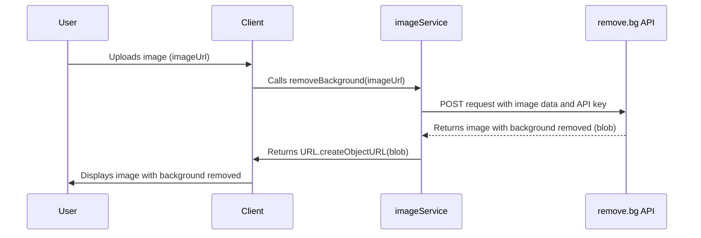
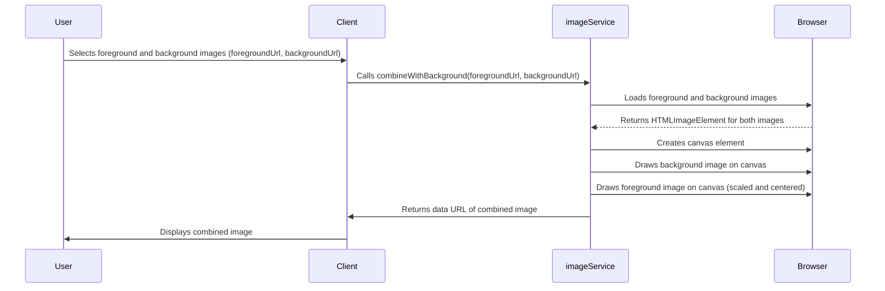
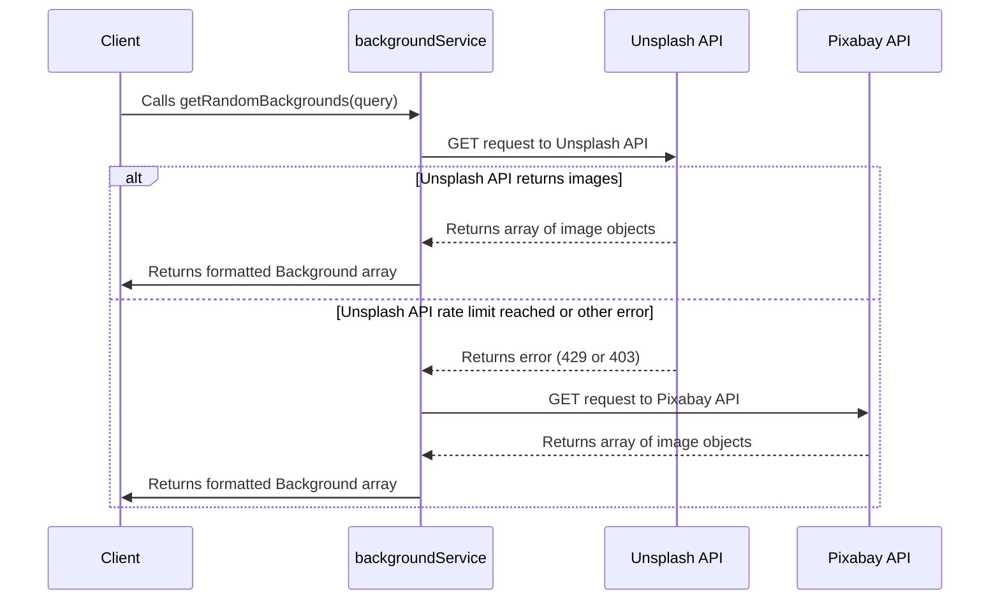
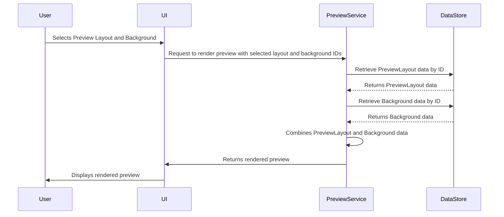
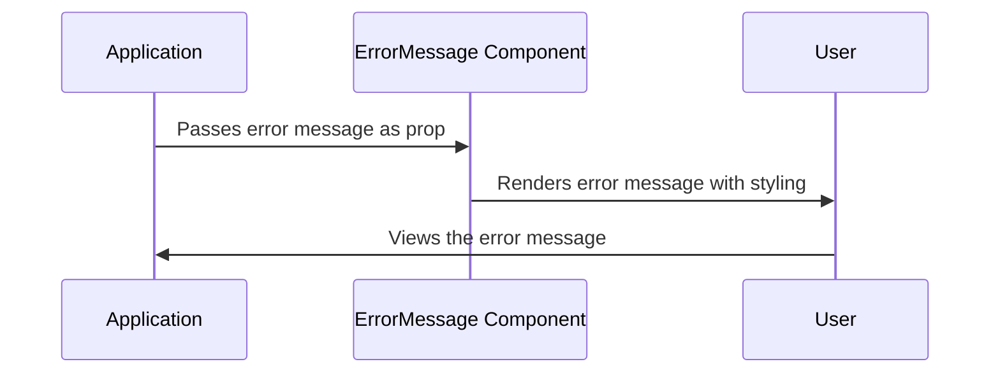
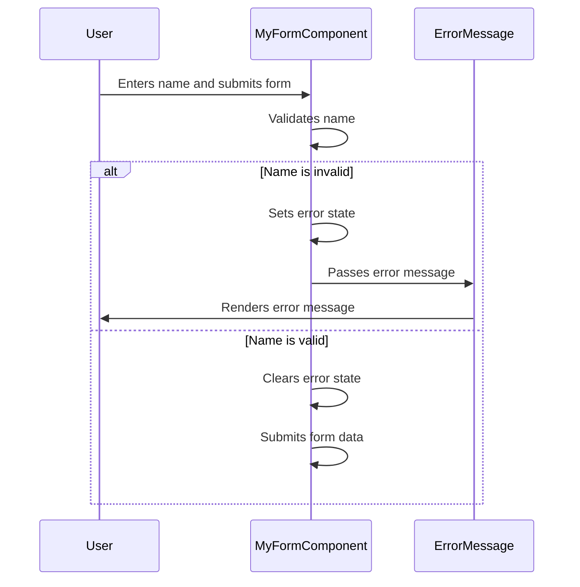
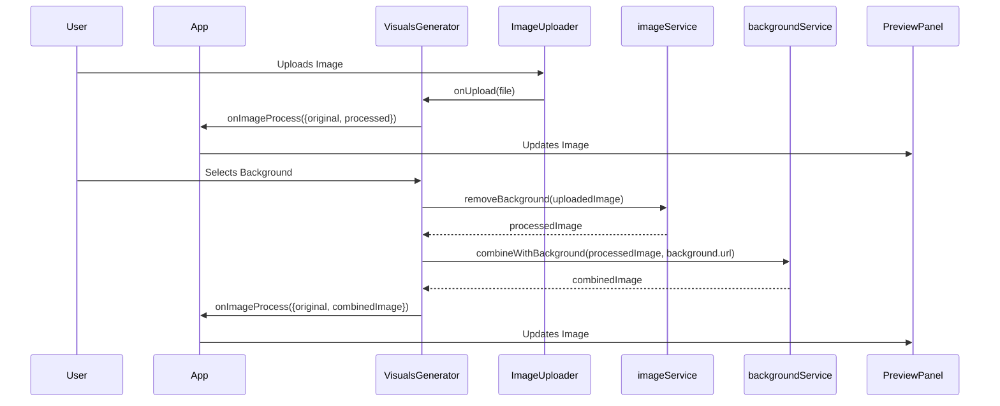
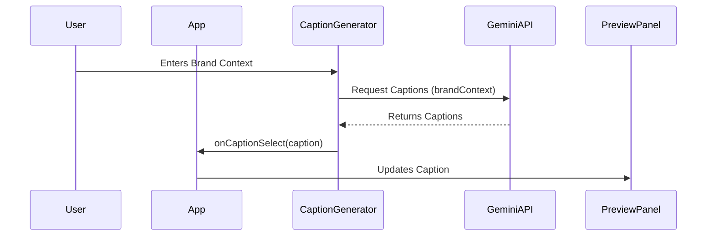
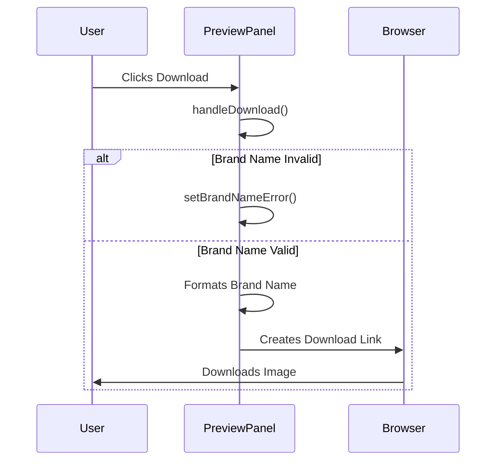

# Repository Documentation

## Repository Architecture



## Table of Contents

### 1. Core UI Components & API Integration

No description available

**Sections:**


**1.** [Code Implementation: api.ts](#section-link-module-module_miscellaneous_utilities-section-optimized_code_implementation:_api.ts)

**2.** [Defining Preview Layout Types for Consistent UI Rendering](#section-link-module-module_miscellaneous_utilities-section-optimized_defining_preview_layout_types_for_consistent_ui_rendering)

**3.** [Displaying User-Friendly Error Messages with the ErrorMessage Component](#section-link-module-module_miscellaneous_utilities-section-optimized_displaying_user-friendly_error_messages_with_the_errormessage_component)

**4.** [Skeleton Components: Enhance User Experience with Loading Placeholders](#section-link-module-module_miscellaneous_utilities-section-optimized_skeleton_components:_enhance_user_experience_with_loading_placeholders)

---


## Navigation Guide

- **Modules**: Browse through organized code modules in the left sidebar
- **Sections**: Each module contains multiple documentation sections
- **Search**: Use the search bar to quickly find specific content
- **Headings**: Use the right sidebar to navigate within long documents
- **Actions**: Copy or download any section content using the toolbar buttons

## Image and Background Service Documentation

This document provides a comprehensive overview of the image and background services, detailing their functionality, architecture, usage, and implementation. These services are crucial for manipulating images, removing backgrounds, combining images, and fetching background images from external APIs.

### 1. Overview

The `api.ts` file houses the core logic for image manipulation and background retrieval. It exposes two main service objects: `imageService` and `backgroundService`. The `imageService` provides functionalities to remove backgrounds from images and combine foreground images with backgrounds. The `backgroundService` fetches random background images from Unsplash and Pixabay APIs. Additionally, a `captionService` is included, currently providing mock caption generation.

### 2. Technical Architecture

The system relies on the following key components:

*   **`axios`**: For making HTTP requests to external APIs (remove.bg, Unsplash, Pixabay).
*   **`FormData`**: For sending image data to the remove.bg API.
*   **`HTMLCanvasElement`**: For combining images on the client-side.
*   **Environment Variables**: `VITE_REMOVEBG_API_KEY`, `VITE_UNSPLASH_ACCESS_KEY`, and `VITE_PIXABAY_API_KEY` store API keys for external services.
*   **`Background` type**: Represents the structure of a background image object (defined in `../types`).

The `imageService` and `backgroundService` are independent modules within the `api.ts` file, but they are often used together in workflows where a user uploads an image, the background is removed, and then the image is combined with a new background.

### 3. Main Workflows and Data Flows

#### 3.1. Removing Background from an Image

This workflow describes how the `removeBackground` function in `imageService` removes the background from an image.



**Explanation:**

1.  The user uploads an image, and the client-side code obtains the image URL.
2.  The client calls the `removeBackground` function in the `imageService` with the image URL.
3.  The `removeBackground` function fetches the image as a blob, creates a `FormData` object, and sends a POST request to the remove.bg API with the image data and API key.
4.  The remove.bg API processes the image and returns a blob representing the image with the background removed.
5.  The `removeBackground` function creates a URL for the blob using `URL.createObjectURL` and returns it to the client.
6.  The client displays the image with the background removed to the user.

**Code Example:**

```typescript
import { imageService } from './api';

async function processImage(imageUrl: string) {
  try {
    const processedImageUrl = await imageService.removeBackground(imageUrl);
    console.log('Image with background removed:', processedImageUrl);
    // Display the processedImageUrl in an  tag
  } catch (error: any) {
    console.error('Error processing image:', error.message);
  }
}
```

#### 3.2. Combining Image with a Background

This workflow describes how the `combineWithBackground` function in `imageService` combines a foreground image with a background image.



**Explanation:**

1.  The user selects a foreground image and a background image, and the client-side code obtains their URLs.
2.  The client calls the `combineWithBackground` function in the `imageService` with the foreground and background image URLs.
3.  The `combineWithBackground` function uses the `loadImage` helper function to load both images into `HTMLImageElement` objects.
4.  A canvas element is created, and the background image is drawn onto it, filling the entire canvas.
5.  The foreground image is scaled down to maintain its aspect ratio and leave some padding. It's then centered on the canvas.
6.  The foreground image is drawn onto the canvas.
7.  The canvas content is converted to a data URL (PNG format) and returned to the client.
8.  The client displays the combined image to the user.

**Code Example:**

```typescript
import { imageService } from './api';

async function combineImages(foregroundUrl: string, backgroundUrl: string) {
  try {
    const combinedImageUrl = await imageService.combineWithBackground(foregroundUrl, backgroundUrl);
    console.log('Combined image URL:', combinedImageUrl);
    // Display the combinedImageUrl in an  tag
  } catch (error: any) {
    console.error('Error combining images:', error.message);
  }
}
```

#### 3.3. Fetching Random Backgrounds

This workflow describes how the `getRandomBackgrounds` function in `backgroundService` fetches random background images from Unsplash or Pixabay.



**Explanation:**

1.  The client calls the `getRandomBackgrounds` function in the `backgroundService` with an optional query string.
2.  The `getRandomBackgrounds` function first attempts to fetch images from the Unsplash API.
3.  If the Unsplash API returns images successfully, the function formats the response into an array of `Background` objects and returns it to the client.
4.  If the Unsplash API returns a rate limit error (429) or another error (403), the function falls back to the Pixabay API.
5.  The function fetches images from the Pixabay API, formats the response into an array of `Background` objects, and returns it to the client.
6.  If both APIs fail, an error is thrown.

**Code Example:**

```typescript
import { backgroundService } from './api';

async function fetchBackgrounds() {
  try {
    const backgrounds = await backgroundService.getRandomBackgrounds('nature');
    console.log('Background images:', backgrounds);
    // Display the background images in a gallery
  } catch (error: any) {
    console.error('Error fetching backgrounds:', error.message);
  }
}
```

### 4. Code Examples and Usage

#### 4.1. Removing Background

```typescript
import { imageService } from './api';

async function removeBgFromUrl(imageUrl: string) {
  try {
    const bgRemovedImageUrl = await imageService.removeBackground(imageUrl);
    console.log("Background removed image URL:", bgRemovedImageUrl);
    // Display the image in an  tag
  } catch (error) {
    console.error("Failed to remove background:", error);
  }
}

removeBgFromUrl('https://example.com/image.jpg');
```

#### 4.2. Combining with Background

```typescript
import { imageService } from './api';

async function combineImagesExample(foregroundUrl: string, backgroundUrl: string) {
  try {
    const combinedImageUrl = await imageService.combineWithBackground(foregroundUrl, backgroundUrl);
    console.log("Combined image URL:", combinedImageUrl);
    // Display the image in an  tag
  } catch (error) {
    console.error("Failed to combine images:", error);
  }
}

combineImagesExample('https://example.com/foreground.png', 'https://example.com/background.jpg');
```

#### 4.3. Getting Random Backgrounds

```typescript
import { backgroundService } from './api';

async function getRandomBgs() {
  try {
    const backgrounds = await backgroundService.getRandomBackgrounds('abstract');
    backgrounds.forEach(bg => {
      console.log(`URL: ${bg.url}, Credit: ${bg.credit}`);
      // Display the images in a gallery
    });
  } catch (error) {
    console.error("Failed to fetch backgrounds:", error);
  }
}

getRandomBgs();
```

### 5. Important Implementation Details and Gotchas

*   **CORS**: When combining images, the `crossOrigin = 'anonymous'` attribute is crucial for loading images from different domains. Without it, the canvas might be tainted, and you won't be able to convert it to a data URL.
*   **API Keys**: Ensure that the API keys for remove.bg, Unsplash, and Pixabay are correctly set in the environment variables.
*   **Error Handling**: The code includes error handling for API requests and image processing. It's important to handle errors gracefully and provide informative messages to the user.
*   **Rate Limiting**: The Unsplash API has rate limits. The code includes a fallback to Pixabay if the Unsplash API returns a rate limit error.
*   **Image Scaling**: When combining images, the foreground image is scaled down to maintain its aspect ratio and leave some padding. This ensures that the foreground image fits nicely within the background.
*   **Blob Handling**: The `removeBackground` function uses `responseType: 'blob'` to receive the image data as a blob. This is necessary for creating a URL for the image using `URL.createObjectURL`.

### 6. Common Issues and Troubleshooting

*   **CORS Errors**: If you encounter CORS errors, make sure that the images you are trying to load have the `Access-Control-Allow-Origin` header set to `*` or your domain.
*   **API Key Errors**: If you encounter API key errors, double-check that your API keys are correctly set in the environment variables.
*   **Rate Limit Errors**: If you encounter rate limit errors, try reducing the number of requests you are making to the API. You can also implement a caching mechanism to avoid making unnecessary requests.
*   **Image Loading Errors**: If you encounter image loading errors, make sure that the image URLs are correct and that the images are accessible.
*   **Canvas Errors**: If you encounter canvas errors, make sure that the canvas context is properly initialized and that you are using the correct drawing methods.

### 7. Advanced Configuration and Customization Options

*   **Custom Background Queries**: You can customize the background images that are fetched by passing a different query string to the `getRandomBackgrounds` function.
*   **Custom Image Scaling**: You can customize the image scaling logic in the `combineWithBackground` function to achieve different effects.
*   **API Key Management**: You can use a more sophisticated API key management system to handle API keys securely.
*   **Caching**: You can implement a caching mechanism to cache background images and avoid making unnecessary API requests.

### 8. Performance Considerations and Optimization Strategies

*   **Image Optimization**: Optimize images before uploading them to reduce their file size and improve performance.
*   **Caching**: Cache background images to avoid making unnecessary API requests.
*   **Lazy Loading**: Use lazy loading to load images only when they are visible on the screen.
*   **Web Workers**: Use web workers to perform image processing tasks in the background and avoid blocking the main thread.

### 9. Security Implications and Best Practices

*   **API Key Security**: Protect your API keys by storing them in environment variables and avoiding committing them to your code repository.
*   **Input Validation**: Validate user input to prevent malicious attacks.
*   **CORS**: Configure CORS properly to prevent cross-site scripting (XSS) attacks.
*   **Content Security Policy (CSP)**: Use CSP to restrict the sources from which the browser can load resources.

### 10. ChromapostIcon Component

The `ChromapostIcon.tsx` file defines a simple React component that renders a circular icon with a specific color.

**Code:**

```typescript
interface IconProps {
  className?: string;
}

export const ChromapostIcon = ({ className = "w-8 h-8" }: IconProps) => (
  <svg className={className} viewBox="0 0 24 24" fill="currentColor" xmlns="http://www.w3.org/2000/svg">
    <circle cx="12" cy="12" r="10" fill="#6B46C1" />
  </svg>
);
```

**Usage:**

```typescript jsx
import { ChromapostIcon } from './ChromapostIcon';

function MyComponent() {
  return (
    <div>
      <ChromapostIcon className="w-12 h-12 text-red-500" />
    </div>
  );
}
```

**Explanation:**

*   The `ChromapostIcon` component accepts an optional `className` prop, which allows you to customize the size and style of the icon.
*   The component renders an SVG element with a circle inside. The circle is filled with the color `#6B46C1`.
*   The `viewBox` attribute ensures that the icon scales properly.

### 11. Caption Service

The `captionService` currently provides mock caption generation. In the future, it will be integrated with the Gemini API to generate more relevant and engaging captions based on the provided brand context.

**Code:**

```typescript
export const captionService = {
  async generateCaptions(brandContext: string): Promise<string[]> {
    try {
      // Here you'll add the Gemini API integration
      // For now, returning mock data based on brand context
      // const prompt = `Generate 4 engaging social media captions for ${brandContext}.
      //   Include emojis and make them attention-grabbing.`

      // Mock response for now
      return [
        `✨ ${brandContext} - Leading the way in innovation`,
        `🚀 Experience the difference with ${brandContext}`,
        `💫 ${brandContext} - Where quality meets excellence`,
        `🎯 Choose ${brandContext} for unmatched quality`
      ]
    } catch (error) {
      console.error('Error generating captions:', error)
      throw new Error('Failed to generate captions')
    }
  }
}
```

**Usage:**

```typescript
import { captionService } from './api';

async function generateCaptionsExample(brand: string) {
    try {
        const captions = await captionService.generateCaptions(brand);
        console.log("Generated captions:", captions);
    } catch (error) {
        console.error("Failed to generate captions:", error);
    }
}

generateCaptionsExample("Chromapost");
```

This documentation provides a comprehensive overview of the image and background services, detailing their functionality, architecture, usage, and implementation. It also covers important implementation details, common issues, troubleshooting tips, advanced configuration options, performance considerations, and security best practices.

## Preview Layout and Background Type Definitions

This documentation describes the type definitions used for defining preview layouts and background configurations within the application. These types are crucial for ensuring consistent UI rendering and providing flexible customization options for preview components.

### Overview

The system defines two primary types: `PreviewLayout` and `Background`. `PreviewLayout` describes the structure and metadata of a specific layout used for previews, while `Background` defines the properties of a background that can be applied to a preview. These types are fundamental for managing and displaying previews within the application.

### `PreviewLayout` Type Definition

The `PreviewLayout` type, defined in `src/types/preview.ts`, specifies the structure of a preview layout. It includes properties such as a unique identifier (`id`) and a human-readable name (`name`).

```typescript
// src/types/preview.ts
export type PreviewLayout = {
  id: string;
  name: string;
};
```

**Properties:**

*   `id`: A string representing the unique identifier for the layout. This is used to distinguish between different layouts.
*   `name`: A string representing the human-readable name of the layout. This is used for display purposes in the UI.

**Usage:**

The `PreviewLayout` type is used to represent the available layout options for previewing content. For example, a developer might define several layouts with different arrangements of content elements.

### `Background` Type Definition

The `Background` type, defined in `src/types/index.ts`, specifies the structure of a background configuration. It includes properties such as a unique identifier (`id`) and a URL (`url`) pointing to the background image or color.

```typescript
// src/types/index.ts
export interface Background {
  id: string | number;
  url: string;
}
```

**Properties:**

*   `id`: A string or number representing the unique identifier for the background. This is used to distinguish between different backgrounds.
*   `url`: A string representing the URL of the background image or color. This can be a URL to an image file or a CSS color value.

**Usage:**

The `Background` type is used to represent the available background options for previewing content. For example, a developer might define several backgrounds with different images or colors.

### Workflow: Applying a Background to a Preview Layout

This workflow illustrates how the `PreviewLayout` and `Background` types are used together to render a preview with a specific layout and background.



**Explanation:**

1.  The user selects a preview layout and a background from the UI.
2.  The UI sends a request to the `PreviewService` to render the preview with the selected layout and background IDs.
3.  The `PreviewService` retrieves the `PreviewLayout` data from the `DataStore` using the layout ID.
4.  The `PreviewService` retrieves the `Background` data from the `DataStore` using the background ID.
5.  The `PreviewService` combines the `PreviewLayout` and `Background` data to generate the rendered preview.
6.  The `PreviewService` returns the rendered preview to the UI.
7.  The UI displays the rendered preview to the user.

### Integration Points

The `PreviewLayout` and `Background` types are used in various parts of the application, including:

*   **UI components:** For displaying and selecting preview layouts and backgrounds.
*   **Preview service:** For rendering previews with specific layouts and backgrounds.
*   **Data store:** For storing and retrieving preview layout and background data.

### Dependency Chains

The `src/types/preview.ts` and `src/types/index.ts` files are independent of each other. However, they are both used by other modules in the application that need to work with preview layouts and backgrounds.

### Usage Examples

**Example 1: Defining a Preview Layout**

```typescript
// Example: Defining a PreviewLayout
const myLayout: PreviewLayout = {
  id: "123",
  name: "Two Column Layout",
};

console.log(myLayout.name); // Output: Two Column Layout
```

**Example 2: Defining a Background**

```typescript
// Example: Defining a Background
const myBackground: Background = {
  id: 1,
  url: "https://example.com/image.jpg",
};

console.log(myBackground.url); // Output: https://example.com/image.jpg
```

### Common Issues and Troubleshooting

*   **Incorrect Layout ID:** If the layout ID is incorrect, the preview service will not be able to retrieve the layout data, and the preview will not be rendered correctly.
*   **Incorrect Background URL:** If the background URL is incorrect, the background image will not be displayed, or the background color will not be applied.
*   **Type Mismatch:** Ensure that the data being assigned to the `PreviewLayout` and `Background` types matches the expected types.

### Advanced Configuration and Customization Options

Developers can extend the `PreviewLayout` and `Background` types to include additional properties as needed. For example, they could add a `description` property to the `PreviewLayout` type or a `size` property to the `Background` type.

### Performance Considerations and Optimization Strategies

*   **Caching:** Cache the `PreviewLayout` and `Background` data to reduce the number of database queries.
*   **Image Optimization:** Optimize background images to reduce their file size and improve loading times.

### Security Implications and Best Practices

*   **Input Validation:** Validate user input to prevent injection attacks.
*   **URL Sanitization:** Sanitize background URLs to prevent cross-site scripting (XSS) attacks.

  ## Error Message Component Documentation

This document details the `ErrorMessage` component, a React component responsible for displaying user-friendly error messages within the application. It focuses on providing a clear and consistent visual representation of errors to the user, enhancing the overall user experience.

### Overview

The `ErrorMessage` component is a simple, reusable UI element designed to present error messages to the user in a visually distinct and informative manner. It utilizes Tailwind CSS for styling, ensuring a consistent look and feel across the application. The component accepts a single prop, `message`, which is the string containing the error message to be displayed.

### Component Architecture

The component is a functional React component defined in `src/components/UI/ErrorMessage.tsx`. It does not have any internal state or lifecycle methods. Its primary function is to render a `div` element with specific Tailwind CSS classes that style the error message.

### Workflow: Displaying an Error Message

The following diagram illustrates the workflow for displaying an error message using the `ErrorMessage` component:



**Explanation:**

1.  The `Application` (representing any part of the application that needs to display an error) passes the error message as a prop to the `ErrorMessage` component.
2.  The `ErrorMessage` component renders the error message within a styled `div` element.
3.  The `User` views the rendered error message within the application.

### Code Example

```typescript
// src/components/UI/ErrorMessage.tsx
export default function ErrorMessage({ message }: { message: string }) {
  return (
    <div className="bg-red-50 border border-red-200 text-red-700 px-4 py-3 rounded relative" role="alert">
      {message}
    </div>
  );
}
```

**Explanation:**

*   The component is a functional component that accepts a `message` prop of type string.
*   It returns a `div` element with several Tailwind CSS classes applied:
    *   `bg-red-50`: Sets the background color to a light red.
    *   `border border-red-200`: Adds a border with a light red color.
    *   `text-red-700`: Sets the text color to a darker red.
    *   `px-4 py-3`: Adds horizontal and vertical padding.
    *   `rounded`: Rounds the corners of the div.
    *   `relative`: Sets the position to relative, which can be useful for positioning child elements.
*   `role="alert"`:  Specifies that this element contains important, time-sensitive information.  Screen readers will announce the content of this element immediately.
*   The `{message}` is rendered as the content of the `div`, displaying the actual error message.

### Usage

To use the `ErrorMessage` component, import it into the desired component and pass the error message as a prop:

```typescript
import ErrorMessage from './components/UI/ErrorMessage';

function MyComponent() {
  const errorMessage = "An error occurred while processing your request.";

  return (
    <div>
      {errorMessage && <ErrorMessage message={errorMessage} />}
    </div>
  );
}

export default MyComponent;
```

**Explanation:**

1.  The `ErrorMessage` component is imported.
2.  An `errorMessage` variable is defined, holding the error message string.
3.  The `ErrorMessage` component is conditionally rendered using a short-circuit evaluation (`errorMessage && ...`). This ensures that the component is only rendered if there is an error message to display.
4.  The `errorMessage` variable is passed as the `message` prop to the `ErrorMessage` component.

### Styling and Customization

The `ErrorMessage` component is styled using Tailwind CSS. To customize the appearance of the component, you can modify the Tailwind CSS classes applied to the `div` element. For example, you can change the background color, border color, text color, padding, or border radius.

You can also add additional CSS classes to further customize the appearance of the component.

### Error Propagation

The `ErrorMessage` component itself does not handle error propagation. It simply displays the error message that is passed to it. The error propagation logic should be handled by the parent component or a global error handling mechanism.

### Performance Considerations

The `ErrorMessage` component is a simple component and should not have any significant performance impact. However, it is important to avoid unnecessary re-renders of the component. This can be achieved by memoizing the component or by ensuring that the `message` prop only changes when the error message actually changes.

### Security Implications

The `ErrorMessage` component displays the error message that is passed to it. It is important to ensure that the error message does not contain any sensitive information, such as passwords or API keys.  Sanitize any user input before displaying it in an error message to prevent Cross-Site Scripting (XSS) vulnerabilities.

### Common Issues and Troubleshooting

*   **Error message not displaying:** Ensure that the `message` prop is being passed correctly to the `ErrorMessage` component and that the component is being rendered. Check for any conditional rendering logic that might be preventing the component from being displayed.
*   **Incorrect styling:** Verify that Tailwind CSS is properly configured in your project and that the Tailwind CSS classes are being applied correctly to the `div` element. Check for any conflicting CSS styles that might be overriding the Tailwind CSS styles.
*   **Error message contains sensitive information:** Review the error message and remove any sensitive information. Sanitize any user input before displaying it in the error message.

### Advanced Configuration and Customization

For more advanced customization, you could consider creating a more generic "Alert" component that accepts different types of messages (success, warning, error, info) and applies different styling based on the message type. This would allow you to reuse the same component for different types of alerts and maintain a consistent look and feel across the application.

### Component Relationships

The `ErrorMessage` component is a standalone component and does not have any direct dependencies on other components within the codebase. It is designed to be reusable and can be used in any component that needs to display an error message.

### Data Flow

The data flow for the `ErrorMessage` component is simple: the parent component passes the error message as a prop, and the component renders the message. There is no internal state or data manipulation within the component.

### Execution Flow

The execution flow for the `ErrorMessage` component is as follows:

1.  The parent component renders the `ErrorMessage` component, passing the error message as a prop.
2.  The `ErrorMessage` component receives the `message` prop.
3.  The `ErrorMessage` component renders the `div` element with the error message and styling.
4.  The rendered `div` element is displayed to the user.

### Integration Points

The `ErrorMessage` component can be integrated into any part of the application that needs to display error messages. It is a simple and reusable component that can be easily integrated into existing components.

### Dependency Chains

The `ErrorMessage` component has a direct dependency on React and Tailwind CSS. It uses React to render the component and Tailwind CSS to style the component.

### Call Sequences

The call sequence for the `ErrorMessage` component is as follows:

1.  The parent component calls the `ErrorMessage` component with the error message as a prop.
2.  The `ErrorMessage` component renders the `div` element with the error message and styling.

### State Management

The `ErrorMessage` component does not have any internal state. It is a stateless component that simply renders the error message that is passed to it.

### Connection Examples

```typescript
// Example of using ErrorMessage within a form component

import React, { useState } from 'react';
import ErrorMessage from './ErrorMessage';

function MyFormComponent() {
  const [name, setName] = useState('');
  const [error, setError] = useState('');

  const handleSubmit = (event) => {
    event.preventDefault();
    if (name.length < 3) {
      setError('Name must be at least 3 characters long.');
    } else {
      setError('');
      // Submit the form
      console.log('Form submitted:', name);
    }
  };

  return (
    <form onSubmit={handleSubmit}>
      <label>
        Name:
        <input type="text" value={name} onChange={(e) => setName(e.target.value)} />
      </label>
      <button type="submit">Submit</button>
      {error && <ErrorMessage message={error} />}
    </form>
  );
}

export default MyFormComponent;
```

**Explanation:**

This example demonstrates how to use the `ErrorMessage` component within a form component.

1.  The `MyFormComponent` component maintains a `name` state variable and an `error` state variable.
2.  The `handleSubmit` function is called when the form is submitted.
3.  If the `name` is less than 3 characters long, an error message is set in the `error` state.
4.  The `ErrorMessage` component is conditionally rendered based on the `error` state. If there is an error, the `ErrorMessage` component is rendered with the error message.

### Workflow Visualization

The following diagram illustrates the workflow of the `MyFormComponent` example:



**Explanation:**

1.  The user interacts with the `MyFormComponent` by entering a name and submitting the form.
2.  The `MyFormComponent` validates the entered name.
3.  If the name is invalid (less than 3 characters), the `MyFormComponent` sets the error state with an appropriate error message. The `ErrorMessage` component receives this message and renders it to the user.
4.  If the name is valid, the `MyFormComponent` clears the error state and proceeds to submit the form data.

This documentation provides a comprehensive overview of the `ErrorMessage` component, its architecture, usage, and implementation details. It should serve as a valuable resource for developers working with this component.

# Chromapost UI Component Library Documentation

This document provides a comprehensive overview of the UI components used in the Chromapost application. It details the purpose, usage, and implementation of each component, along with relevant workflows and data flows.

## I. Core UI Components

This section covers the fundamental UI elements used throughout the application.

### 1. Skeleton

The `Skeleton` component provides a placeholder UI while content is loading, enhancing the user experience by indicating that data is being fetched.

**File:** `src/components/UI/Skeleton.tsx`

**Purpose:** To display a visual placeholder before the actual content is loaded.

**Usage:**

```typescript
import Skeleton from './Skeleton';
import { SkeletonText, SkeletonImage } from './Skeleton';

function MyComponent() {
  const isLoading = true; // Replace with actual loading state

  return (
    <div>
      {isLoading ? (
        <>
          <Skeleton className="h-8 w-32 mb-2" />
          <SkeletonText width="80%" />
          <SkeletonText />
          <SkeletonImage />
        </>
      ) : (
        <>
          {/* Actual content */}
          <h1>My Content</h1>
          <p>This is the loaded content.</p>
        </>
      )}
    </div>
  );
}

export default MyComponent;
```

**Component Details:**

*   **`Skeleton`**: The main skeleton component.
    *   **Props:**
        *   `className` (optional):  CSS class names to customize the appearance.
    *   **Implementation:** A `div` with `animate-pulse`, `bg-gray-200`, and `rounded` classes for a pulsing, gray, rounded rectangle.
*   **`SkeletonText`**: A skeleton component specifically for text placeholders.
    *   **Props:**
        *   `width` (optional): The width of the text placeholder (default: "100%").
    *   **Implementation:** A `div` with class `skeleton-text` and inline style for width.
*   **`SkeletonImage`**: A skeleton component specifically for image placeholders.
    *   **Props:** None
    *   **Implementation:** A `div` with class `skeleton-image`.

**Styling:** The component relies on CSS classes for styling.  Ensure that the necessary CSS (e.g., in `index.css`) defines the `animate-pulse`, `bg-gray-200`, `rounded`, `skeleton-text`, and `skeleton-image` classes.

### 2. LoadingSpinner

The `LoadingSpinner` component displays a simple loading animation.

**File:** `src/components/UI/LoadingSpinner.tsx`

**Purpose:** To visually indicate that a process is ongoing.

**Usage:**

```typescript
import LoadingSpinner from './LoadingSpinner';

function MyComponent() {
  const isLoading = true; // Replace with actual loading state

  return (
    <div>
      {isLoading && <LoadingSpinner />}
      {/* Other content */}
    </div>
  );
}

export default MyComponent;
```

**Component Details:**

*   **Implementation:** A `div` with `flex justify-center items-center` classes to center the spinner.  The actual spinner animation is expected to be defined in the CSS (e.g., using keyframes).

**Styling:** The component requires CSS to define the spinner animation.

### 3. LoadingPreview

The `LoadingPreview` component provides a full-screen loading overlay with a blurred background.

**File:** `src/components/UI/LoadingPreview.tsx`

**Purpose:** To block user interaction and provide a clear visual indication of loading, especially during full-screen operations.

**Usage:**

```typescript
import LoadingPreview from './LoadingPreview';

function MyComponent() {
  const isLoading = true; // Replace with actual loading state

  return (
    <div>
      {isLoading && <LoadingPreview />}
      {/* Other content */}
    </div>
  );
}

export default MyComponent;
```

**Component Details:**

*   **Implementation:** A `div` with `absolute inset-0 bg-gray-900/10 backdrop-blur-sm flex items-center justify-center` classes. This creates a semi-transparent, blurred overlay that covers the entire screen and centers its content.

**Styling:** The component relies on CSS classes for styling.

### 4. ImageUploader

The `ImageUploader` component allows users to upload an image file.

**File:** `src/components/UI/ImageUploader.tsx`

**Purpose:** To provide a file input element and handle the selection of an image file.

**Usage:**

```typescript
import ImageUploader from './ImageUploader';

function MyComponent() {
  const handleUpload = (file: File) => {
    // Process the uploaded file
    console.log('Uploaded file:', file);
  };

  return (
    <ImageUploader onUpload={handleUpload} />
  );
}

export default MyComponent;
```

**Component Details:**

*   **Props:**
    *   `onUpload`: A function that accepts a `File` object as an argument. This function is called when a file is selected.
*   **Implementation:**  The component renders an `<input type="file" />` element.  The `handleFileChange` function is triggered when the user selects a file. It extracts the file from the event and calls the `onUpload` prop function.

### 5. Icons

The `Icons` component provides reusable SVG icons for common social media platforms.

**File:** `src/components/UI/Icons.tsx`

**Purpose:** To provide a consistent and easily maintainable set of icons.

**Usage:**

```typescript
import { InstagramIcon, FacebookIcon, WhatsappIcon } from './Icons';

function MyComponent() {
  return (
    <div>
      <InstagramIcon className="w-8 h-8 text-purple-500" />
      <FacebookIcon className="w-8 h-8 text-blue-500" />
      <WhatsappIcon className="w-8 h-8 text-green-500" />
    </div>
  );
}

export default MyComponent;
```

**Component Details:**

*   **`InstagramIcon`**: Displays the Instagram icon.
    *   **Props:**
        *   `className` (optional): CSS class names to customize the appearance.  Defaults to `"w-6 h-6"`.
    *   **Implementation:** An SVG element with the Instagram logo path.
*   **`FacebookIcon`**: Displays the Facebook icon.
    *   **Props:**
        *   `className` (optional): CSS class names to customize the appearance.  Defaults to `"w-6 h-6"`.
    *   **Implementation:** An SVG element with the Facebook logo path.
*   **`WhatsappIcon`**: Displays the WhatsApp icon.
    *   **Props:**
        *   `className` (optional): CSS class names to customize the appearance.  Defaults to `"w-6 h-6"`.
    *   **Implementation:** An SVG element with the WhatsApp logo path.

### 6. ChromapostIcon

The `ChromapostIcon` component is used in the header.

**File:** `src/components/UI/ChromapostIcon.tsx` (Not provided, assuming it exists)

**Purpose:** To display the application's logo.

**Usage:**

```typescript
import ChromapostIcon from './ChromapostIcon';

function Header() {
  return (
    <header>
      <ChromapostIcon />
      {/* Other header content */}
    </header>
  );
}
```

**Component Details:** The implementation details are not available in the provided code, but it likely renders an SVG or image representing the Chromapost logo.

## II. Layout Components

These components define the overall structure of the application.

### 1. Header

The `Header` component displays the application's header.

**File:** `src/components/Layout/Header.tsx`

**Purpose:** To provide a consistent header across the application.

**Usage:**

```typescript
import Header from './Header';

function App() {
  return (
    <div>
      <Header />
      {/* Other content */}
    </div>
  );
}
```

**Component Details:**

*   **Implementation:** The component renders a `<header>` element with a background color (`bg-purple-600`). It includes the `ChromapostIcon`.

### 2. Sidebar

The `Sidebar` component provides navigation and settings.

**File:** `src/components/Layout/Sidebar.tsx`

**Purpose:** To provide a consistent navigation experience.

**Usage:**

```typescript
import Sidebar from './Sidebar';

function App() {
  const [activeTab, setActiveTab] = useState('caption');

  const handleTabChange = (tab: string) => {
    setActiveTab(tab);
  };

  return (
    <div>
      <Sidebar activeTab={activeTab} onTabChange={handleTabChange} />
      {/* Other content */}
    </div>
  );
}
```

**Component Details:**

*   **Props:**
    *   `activeTab`: A string representing the currently active tab.
    *   `onTabChange`: A function that accepts a tab ID as an argument and updates the active tab.
*   **Implementation:** The component renders a sidebar with a list of menu items. It uses the `useState` hook to manage the collapsed state of the sidebar. The `menuItems` array defines the structure of the sidebar menu.

### 3. Logo

The `Logo` component displays the application's logo.

**File:** `src/components/Layout/Logo.tsx`

**Purpose:** To provide a consistent logo across the application.

**Usage:**

```typescript
import Logo from './Logo';

function Header() {
  return (
    <header>
      <Logo />
      {/* Other header content */}
    </header>
  );
}
```

**Component Details:**

*   **Implementation:** The component renders a `div` with `flex items-center` classes. The actual logo implementation is not provided.

## III. Generator Components

These components provide the core functionality of the application.

### 1. VisualsGenerator

The `VisualsGenerator` component allows users to upload an image and apply background effects.

**File:** `src/components/Generators/VisualsGenerator.tsx`

**Purpose:** To enable users to enhance their images by removing the background and combining them with different backgrounds.

**Usage:**

```typescript
import VisualsGenerator from './VisualsGenerator';

function App() {
  const handleImageProcess = (image: { original: string, processed: string }) => {
    // Update the current image
    console.log('Processed image:', image);
  };

  return (
    <VisualsGenerator onImageProcess={handleImageProcess} />
  );
}
```

**Component Details:**

*   **Props:**
    *   `onImageProcess`: A function that accepts an object with `original` and `processed` image URLs. This function is called when a new image is processed.
    *   `isMobilePreview`: A boolean indicating whether the preview is in mobile mode.
*   **State:**
    *   `loading`: A boolean indicating whether the component is currently loading data.
    *   `uploadedImage`: A string containing the URL of the uploaded image.
    *   `processedImage`: A string containing the URL of the processed image (background removed).
    *   `backgrounds`: An array of `Background` objects representing available backgrounds.
    *   `selectedBackground`: A `Background` object representing the currently selected background.
    *   `error`: A string containing an error message, if any.
    *   `selectedCategory`: An object representing the currently selected background category.
    *   `isMobileView`: A boolean indicating whether the component is in mobile view.
*   **Implementation:**
    1.  **Image Upload:** Uses the `ImageUploader` component to handle image uploads.
    2.  **Background Selection:** Displays a list of available backgrounds.
    3.  **Image Processing:** Uses the `imageService` and `backgroundService` APIs to remove the background from the uploaded image and combine it with the selected background.
    4.  **Error Handling:** Displays error messages if any errors occur during image processing or background loading.
*   **Data Flow:**
    1.  The user uploads an image using the `ImageUploader` component.
    2.  The `handleImageUpload` function is called, which sets the `uploadedImage` state and calls the `onImageProcess` prop function.
    3.  The user selects a background from the list of available backgrounds.
    4.  The `handleBackgroundSelect` function is called, which sets the `selectedBackground` state and calls the `imageService` and `backgroundService` APIs to process the image.
    5.  The `onImageProcess` prop function is called with the processed image URL.
*   **API Integrations:**
    *   `imageService`: Provides methods for removing the background from an image and combining it with a background.
    *   `backgroundService`: Provides methods for retrieving random backgrounds.

### 2. CaptionGenerator

The `CaptionGenerator` component generates captions based on the provided brand context.

**File:** `src/components/Generators/CaptionGenerator.tsx`

**Purpose:** To assist users in creating engaging captions for their images.

**Usage:**

```typescript
import CaptionGenerator from './CaptionGenerator';

function App() {
  const handleCaptionSelect = (caption: string) => {
    // Update the current caption
    console.log('Selected caption:', caption);
  };

  return (
    <CaptionGenerator onCaptionSelect={handleCaptionSelect} brandName="MyBrand" />
  );
}
```

**Component Details:**

*   **Props:**
    *   `onCaptionSelect`: A function that accepts a caption string as an argument. This function is called when a caption is selected.
    *   `brandName`: A string representing the brand name.
*   **State:**
    *   `loading`: A boolean indicating whether the component is currently loading data.
    *   `brandContext`: A string containing the brand context.
    *   `captions`: An array of caption strings.
    *   `error`: A string containing an error message, if any.
*   **Implementation:**
    1.  **Brand Context Input:** Provides a text input for the user to enter the brand context.
    2.  **Caption Generation:** Uses the `generateCaptions` function to generate captions based on the brand context.  Currently uses mock data.
    3.  **Caption Selection:** Displays a list of generated captions.
*   **Data Flow:**
    1.  The user enters the brand context in the text input.
    2.  The `generateCaptions` function is called, which updates the `captions` state with the generated captions.
    3.  The user selects a caption from the list of generated captions.
    4.  The `onCaptionSelect` prop function is called with the selected caption.
*   **API Integrations:**  The component is intended to integrate with the Gemini API (or similar) for caption generation.  Currently, it uses mock data.

## IV. Preview Component

### 1. PreviewPanel

The `PreviewPanel` component displays a preview of the image with the selected caption and allows the user to download the image.

**File:** `src/components/Preview/PreviewPanel.tsx`

**Purpose:** To provide a visual representation of the final image and caption before downloading.

**Usage:**

```typescript
import PreviewPanel from './PreviewPanel';

function App() {
  const [currentImage, setCurrentImage] = useState({ original: '', processed: '' });
  const [currentCaption, setCurrentCaption] = useState('');
  const [brandName, setBrandName] = useState('');
  const [isMobilePreview, setIsMobilePreview] = useState(false);

  return (
    <PreviewPanel
      originalImage={currentImage.original}
      processedImage={currentImage.processed}
      caption={currentCaption}
      brandName={brandName}
      setBrandName={setBrandName}
      isMobilePreview={isMobilePreview}
      setIsMobilePreview={setIsMobilePreview}
    />
  );
}
```

**Component Details:**

*   **Props:**
    *   `originalImage`: A string containing the URL of the original image.
    *   `processedImage`: A string containing the URL of the processed image.
    *   `caption`: A string containing the caption.
    *   `brandName`: A string containing the brand name.
    *   `setBrandName`: A function that accepts a brand name string as an argument and updates the brand name state.
    *   `isMobilePreview`: A boolean indicating whether the preview is in mobile mode.
    *   `setIsMobilePreview`: A function that accepts a boolean as an argument and updates the mobile preview state.
*   **State:**
    *   `selectedLayout`: A `PreviewLayout` object representing the currently selected layout.
    *   `selectedEffect`: An object representing the currently selected effect.
    *   `brandNameError`: A string containing an error message, if any.
*   **Implementation:**
    1.  **Layout Selection:** Provides a list of available layouts for different social media platforms.
    2.  **Effect Selection:** Provides a list of available image effects.
    3.  **Image Preview:** Displays the processed image with the selected caption and layout.
    4.  **Download:** Allows the user to download the image.
*   **Data Flow:**
    1.  The component receives the `originalImage`, `processedImage`, `caption`, and `brandName` props.
    2.  The user selects a layout and an effect.
    3.  The component displays the image with the selected layout, effect, and caption.
    4.  The user clicks the download button.
    5.  The `handleDownload` function is called, which generates a file name based on the brand name, layout, and timestamp, and downloads the image.
*   **Icons:** Uses `InstagramIcon`, `FacebookIcon`, and `WhatsappIcon` from `src/components/UI/Icons.tsx`.

## V. Navigation Component

### 1. TabNav

The `TabNav` component provides a tab-based navigation.

**File:** `src/components/Navigation/TabNav.tsx`

**Purpose:** To allow users to switch between different sections of the application.

**Usage:**

```typescript
import TabNav from './TabNav';

function App() {
  const [activeTab, setActiveTab] = useState('visuals');

  const handleTabChange = (tab: string) => {
    setActiveTab(tab);
  };

  return (
    <TabNav activeTab={activeTab} onTabChange={handleTabChange} />
  );
}
```

**Component Details:**

*   **Props:**
    *   `activeTab`: A string representing the currently active tab.
    *   `onTabChange`: A function that accepts a tab ID as an argument and updates the active tab.
*   **Implementation:** The component renders a horizontal list of tabs. The `activeTab` prop determines which tab is currently active. The `onTabChange` prop function is called when the user clicks on a tab.

## VI. Error Handling

### 1. ErrorBoundary

The `ErrorBoundary` component provides a way to catch JavaScript errors anywhere in the component tree and display a fallback UI.

**File:** `src/components/ErrorBoundary.tsx`

**Purpose:** To prevent the entire application from crashing when an error occurs in a component.

**Usage:**

```typescript
import ErrorBoundary from './ErrorBoundary';

function App() {
  return (
    <ErrorBoundary>
      {/* Your application content */}
    </ErrorBoundary>
  );
}
```

**Component Details:**

*   **Implementation:** The component uses the `getDerivedStateFromError` lifecycle method to catch errors and update the component's state. If an error occurs, the component renders a fallback UI.

## VII. Application Entry Point

### 1. main.tsx

The `main.tsx` file is the entry point of the application.

**File:** `src/main.tsx`

**Purpose:** To render the `App` component into the DOM.

**Usage:**

```typescript
import React from 'react'
import ReactDOM from 'react-dom/client'
import App from './App'
import ErrorBoundary from './components/ErrorBoundary'
import './index.css'

ReactDOM.createRoot(document.getElementById('root')!).render(
  <React.StrictMode>
    <ErrorBoundary>
      <App />
    </ErrorBoundary>
  </React.StrictMode>,
)
```

**Component Details:**

*   **Implementation:** The file imports the `React`, `ReactDOM`, `App`, and `ErrorBoundary` components. It then renders the `App` component inside the `ErrorBoundary` component into the DOM element with the ID `root`.

## VIII. Application Component

### 1. App.tsx

The `App.tsx` file is the main application component.

**File:** `src/App.tsx`

**Purpose:** To orchestrate the different components and manage the application's state.

**Usage:**

```typescript
import { useState, useEffect } from 'react'
import Header from './components/Layout/Header'
import VisualsGenerator from './components/Generators/VisualsGenerator'
import CaptionGenerator from './components/Generators/CaptionGenerator'
import PreviewPanel from './components/Preview/PreviewPanel'

interface ProcessedImage {
  original: string;
  processed: string;
}

export default function App() {
  const [currentImage, setCurrentImage] = useState<ProcessedImage | null>(null)
  const [currentCaption, setCurrentCaption] = useState<string>('')
  const [brandName, setBrandName] = useState<string>('')
  const [isMobilePreview, setIsMobilePreview] = useState(false)
  const [showWelcome, setShowWelcome] = useState(false)

  useEffect(() => {
    const isFirstVisit = localStorage.getItem('isFirstVisit')
    if (!isFirstVisit) {
      setShowWelcome(true)
      localStorage.setItem('isFirstVisit', 'false')
    }
  }, [])

  return (
    <>
      <Header />
      <VisualsGenerator onImageProcess={(image) => setCurrentImage(image)} isMobilePreview={isMobilePreview} />
      <CaptionGenerator onCaptionSelect={(caption) => setCurrentCaption(caption)} brandName={brandName} />
      <PreviewPanel
        originalImage={currentImage?.original}
        processedImage={currentImage?.processed}
        caption={currentCaption}
        brandName={brandName}
        setBrandName={setBrandName}
        isMobilePreview={isMobilePreview}
        setIsMobilePreview={setIsMobilePreview}
      />
    </>
  )
}
```

**Component Details:**

*   **State:**
    *   `currentImage`: An object containing the URLs of the original and processed images.
    *   `currentCaption`: A string containing the current caption.
    *   `brandName`: A string containing the brand name.
    *   `isMobilePreview`: A boolean indicating whether the preview is in mobile mode.
    *   `showWelcome`: A boolean indicating whether to show the welcome message.
*   **Implementation:**
    1.  **Header:** Renders the `Header` component.
    2.  **Visuals Generator:** Renders the `VisualsGenerator` component and passes the `onImageProcess` prop to update the `currentImage` state.
    3.  **Caption Generator:** Renders the `CaptionGenerator` component and passes the `onCaptionSelect` prop to update the `currentCaption` state and the `brandName` prop.
    4.  **Preview Panel:** Renders the `PreviewPanel` component and passes the `originalImage`, `processedImage`, `caption`, `brandName`, `setBrandName`, `isMobilePreview`, and `setIsMobilePreview` props.

## IX. Configuration Files

### 1. vite.config.ts

The `vite.config.ts` file configures the Vite build tool.

**File:** `src/vite.config.ts`

**Purpose:** To configure the build process for the application.

**Component Details:**

*   **Implementation:** The file imports the `defineConfig` function from the `vite` package and the `react` plugin from the `@vitejs/plugin-react` package. It then exports a configuration object that specifies the plugins to use.

### 2. eslint.config.js

The `eslint.config.js` file configures the ESLint linter.

**File:** `src/eslint.config.js`

**Purpose:** To enforce code style and quality standards.

**Component Details:**

*   **Implementation:** The file imports several ESLint plugins and configurations. It then exports a configuration object that specifies the rules and settings to use.

## X. Workflow Diagrams

### 1. Image Processing Workflow

This diagram illustrates the flow of data and component interactions during the image processing workflow.



**Explanation:**

1.  The user uploads an image via the `ImageUploader`.
2.  The `ImageUploader` calls the `onUpload` function in `VisualsGenerator`, passing the uploaded file.
3.  The `VisualsGenerator` calls the `onImageProcess` function in `App`, passing the original and processed image URLs.
4.  The `App` component updates its state and passes the image URLs to the `PreviewPanel`.
5.  The user selects a background in the `VisualsGenerator`.
6.  The `VisualsGenerator` calls the `imageService` to remove the background from the uploaded image.
7.  The `imageService` returns the processed image URL to the `VisualsGenerator`.
8.  The `VisualsGenerator` calls the `backgroundService` to combine the processed image with the selected background.
9.  The `backgroundService` returns the combined image URL to the `VisualsGenerator`.
10. The `VisualsGenerator` calls the `onImageProcess` function in `App`, passing the original and combined image URLs.
11. The `App` component updates its state and passes the image URLs to the `PreviewPanel`.

### 2. Caption Generation Workflow

This diagram illustrates the flow of data and component interactions during the caption generation workflow.



**Explanation:**

1.  The user enters the brand context in the `CaptionGenerator`.
2.  The `CaptionGenerator` sends a request to the Gemini API (or similar) with the brand context.
3.  The Gemini API returns a list of generated captions to the `CaptionGenerator`.
4.  The user selects a caption from the list.
5.  The `CaptionGenerator` calls the `onCaptionSelect` function in `App`, passing the selected caption.
6.  The `App` component updates its state and passes the caption to the `PreviewPanel`.

### 3. Download Workflow

This diagram illustrates the flow of data and component interactions during the download workflow.



**Explanation:**

1.  The user clicks the download button in the `PreviewPanel`.
2.  The `handleDownload` function is called.
3.  If the brand name is invalid, the `setBrandNameError` function is called.
4.  If the brand name is valid, the brand name is formatted.
5.  The `PreviewPanel` creates a download link in the browser.
6.  The browser downloads the image.

## XI. Common Issues and Troubleshooting

*   **Image Upload Issues:**
    *   **Problem:** Image fails to upload.
    *   **Solution:** Check the file size and type. Ensure that the server is configured to accept the file type and size.
*   **Background Loading Issues:**
    *   **Problem:** Backgrounds fail to load.
    *   **Solution:** Check the network connection. Ensure that the `backgroundService` API is available and returns valid data.
*   **Caption Generation Issues:**
    *   **Problem:** Captions fail to generate.
    *   **Solution:** Check the network connection. Ensure that the Gemini API (or similar) is available and returns valid data.  Verify that the brand context is provided.
*   **Download Issues:**
    *   **Problem:** Image fails to download.
    *   **Solution:** Check the browser settings. Ensure that downloads are enabled.  Verify that the brand name is provided.

## XII. Advanced Configuration and Customization Options

*   **Customizing Styles:** All components use CSS classes for styling. You can customize the appearance of the components by overriding the default CSS classes.
*   **Adding New Layouts:** You can add new layouts to the `PREVIEW_LAYOUTS` array in the `PreviewPanel` component.
*   **Adding New Effects:** You can add new effects to the `EFFECTS` array in the `PreviewPanel` component.
*   **Integrating with Different APIs:** You can integrate the `CaptionGenerator` component with different caption generation APIs by modifying the `generateCaptions` function.

## XIII. Performance Considerations and Optimization Strategies

*   **Image Optimization:** Optimize images before uploading to reduce file size and improve performance.
*   **Lazy Loading:** Implement lazy loading for backgrounds to improve initial load time.
*   **Caching:** Cache API responses to reduce the number of API calls.

## XIV. Security Implications and Best Practices

*   **Input Validation:** Validate all user inputs to prevent security vulnerabilities.
*   **Sanitization:** Sanitize all user inputs before displaying them to prevent cross-site scripting (XSS) attacks.
*   **Authentication and Authorization:** Implement authentication and authorization to protect sensitive data.
